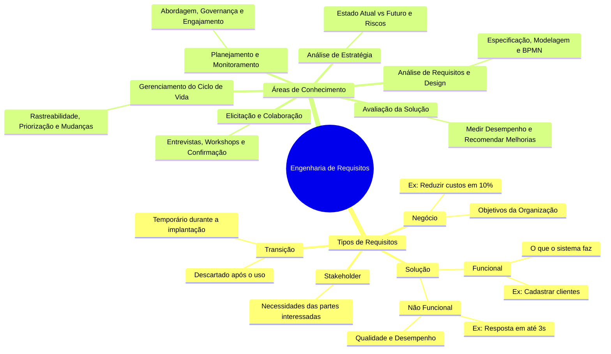

```mermaid
mindmap
  root((Engenharia de Requisitos))
    Tipos de Requisitos
      Negócio
        Objetivos da Organização
        Ex: Reduzir custos em 10%
      Stakeholder
        Necessidades das partes interessadas
      Solução
        Funcional
          O que o sistema faz
          Ex: Cadastrar clientes
        Não Funcional
          Qualidade e Desempenho
          Ex: Resposta em até 3s
      Transição
        Temporário durante a implantação
        Descartado após o uso
    Áreas de Conhecimento
      Planejamento e Monitoramento
        Abordagem, Governança e Engajamento
      Elicitação e Colaboração
        Entrevistas, Workshops e Confirmação
      Gerenciamento do Ciclo de Vida
        Rastreabilidade, Priorização e Mudanças
      Análise de Estratégia
        Estado Atual vs Futuro e Riscos
      Análise de Requisitos e Design
        Especificação, Modelagem e BPMN
      Avaliação da Solução
        Medir Desempenho e Recomendar Melhorias
```
