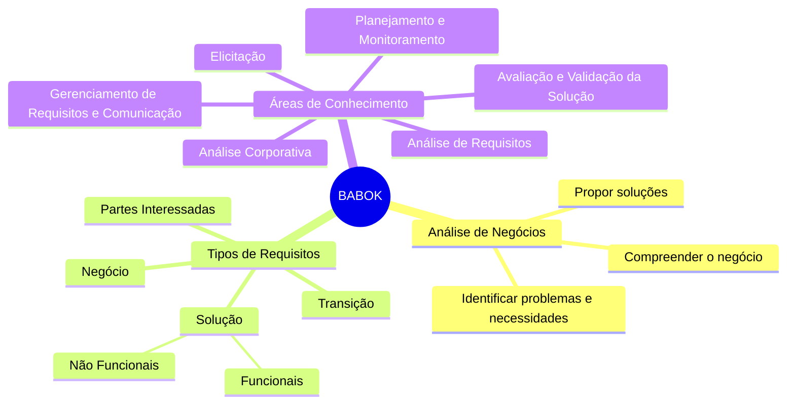

```mermaid
mindmap
  root((BABOK))
    Análise de Negócios
      Identificar problemas e necessidades
      Compreender o negócio
      Propor soluções

    Tipos de Requisitos
      Negócio
      Partes Interessadas
      Solução
        Funcionais
        Não Funcionais
      Transição

    Áreas de Conhecimento
      Planejamento e Monitoramento
      Elicitação
      Gerenciamento de Requisitos e Comunicação
      Análise Corporativa
      Análise de Requisitos
      Avaliação e Validação da Solução
```
