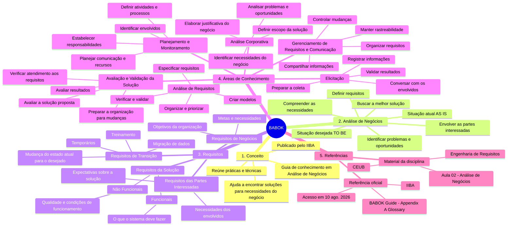

```mermaid
mindmap
  root((BABOK))
    1. Conceito
      Guia de conhecimento em Análise de Negócios
      Publicado pelo IIBA
      Reúne práticas e técnicas
      Ajuda a encontrar soluções para necessidades do negócio

    2. Análise de Negócios
      Identificar problemas e oportunidades
      Compreender as necessidades
      Envolver as partes interessadas
      Definir requisitos
      Buscar a melhor solução
      Situação atual AS IS
      Situação desejada TO BE

    3. Requisitos
      Requisitos de Negócios
        Objetivos da organização
        Metas e necessidades
      Requisitos das Partes Interessadas
        Necessidades dos envolvidos
        Expectativas sobre a solução
      Requisitos da Solução
        Funcionais
          O que o sistema deve fazer
        Não Funcionais
          Qualidade e condições de funcionamento
      Requisitos de Transição
        Temporários
        Migração de dados
        Treinamento
        Mudança do estado atual para o desejado

    4. Áreas de Conhecimento
      Planejamento e Monitoramento
        Definir atividades e processos
        Identificar envolvidos
        Estabelecer responsabilidades
        Planejar comunicação e recursos
      Elicitação
        Preparar a coleta
        Conversar com os envolvidos
        Registrar informações
        Validar resultados
      Gerenciamento de Requisitos e Comunicação
        Organizar requisitos
        Controlar mudanças
        Manter rastreabilidade
        Compartilhar informações
      Análise Corporativa
        Identificar necessidades do negócio
        Analisar problemas e oportunidades
        Definir escopo da solução
        Elaborar justificativa do negócio
      Análise de Requisitos
        Organizar e priorizar
        Especificar requisitos
        Criar modelos
        Verificar e validar
      Avaliação e Validação da Solução
        Avaliar a solução proposta
        Verificar atendimento aos requisitos
        Preparar a organização para mudanças
        Avaliar resultados

    5. Referências
      Material da disciplina
        Engenharia de Requisitos
        Aula 02 - Análise de Negócios
        CEUB
      Referência oficial
        IIBA
        BABOK Guide - Appendix A Glossary
        Acesso em 10 ago. 2026
```
