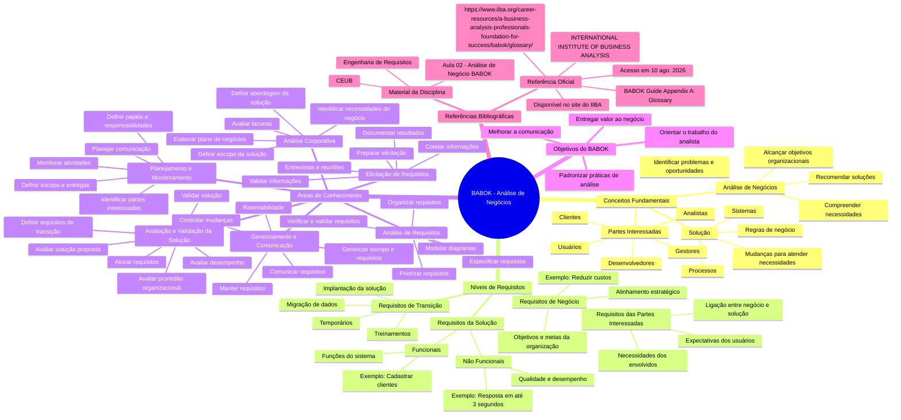

```mermaid
mindmap
  root((BABOK - Análise de Negócios))
    Conceitos Fundamentais
      Análise de Negócios
        Identificar problemas e oportunidades
        Compreender necessidades
        Recomendar soluções
        Alcançar objetivos organizacionais
      Partes Interessadas
        Clientes
        Usuários
        Analistas
        Desenvolvedores
        Gestores
      Solução
        Mudanças para atender necessidades
        Processos
        Sistemas
        Regras de negócio

    Níveis de Requisitos
      Requisitos de Negócio
        Objetivos e metas da organização
        Alinhamento estratégico
        Exemplo: Reduzir custos
      Requisitos das Partes Interessadas
        Necessidades dos envolvidos
        Expectativas dos usuários
        Ligação entre negócio e solução
      Requisitos da Solução
        Funcionais
          Funções do sistema
          Exemplo: Cadastrar clientes
        Não Funcionais
          Qualidade e desempenho
          Exemplo: Resposta em até 3 segundos
      Requisitos de Transição
        Temporários
        Implantação da solução
        Treinamentos
        Migração de dados

    Áreas de Conhecimento
      Planejamento e Monitoramento
        Identificar partes interessadas
        Definir papéis e responsabilidades
        Planejar comunicação
        Definir escopo e entregas
        Monitorar atividades
      Elicitação de Requisitos
        Preparar elicitação
        Entrevistas e reuniões
        Coletar informações
        Documentar resultados
        Validar informações
      Gerenciamento e Comunicação
        Gerenciar escopo e requisitos
        Rastreabilidade
        Controlar mudanças
        Manter requisitos
        Comunicar requisitos
      Análise Corporativa
        Identificar necessidades do negócio
        Avaliar lacunas
        Definir abordagem da solução
        Definir escopo da solução
        Elaborar plano de negócios
      Análise de Requisitos
        Priorizar requisitos
        Organizar requisitos
        Especificar requisitos
        Modelar diagramas
        Verificar e validar requisitos
      Avaliação e Validação da Solução
        Avaliar solução proposta
        Alocar requisitos
        Avaliar prontidão organizacional
        Definir requisitos de transição
        Validar solução
        Avaliar desempenho

    Objetivos do BABOK
      Padronizar práticas de análise
      Orientar o trabalho do analista
      Melhorar a comunicação
      Entregar valor ao negócio

    Referências Bibliográficas
      Material da Disciplina
        Engenharia de Requisitos
        Aula 02 - Análise de Negócio BABOK
        CEUB
      Referência Oficial
        INTERNATIONAL INSTITUTE OF BUSINESS ANALYSIS
        BABOK Guide Appendix A: Glossary
        Disponível no site do IIBA
        https://www.iiba.org/career-resources/a-business-analysis-professionals-foundation-for-success/babok/glossary/
        Acesso em 10 ago. 2026
```
